# LAB 6 - MICROSERVICES REPORT

### Eureka server

Booting the Eureka server. It's a server for microservices registration, location, load balancing and fault tolerance. 
Eureka register the different instances of existing microservices in the system.

```bash
./gradlew registration:bootRun
```

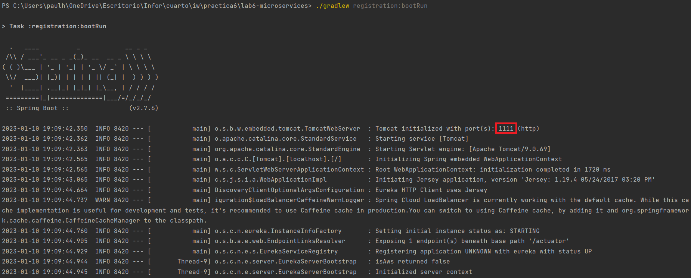

It's exposed at `http:localhost:1111`

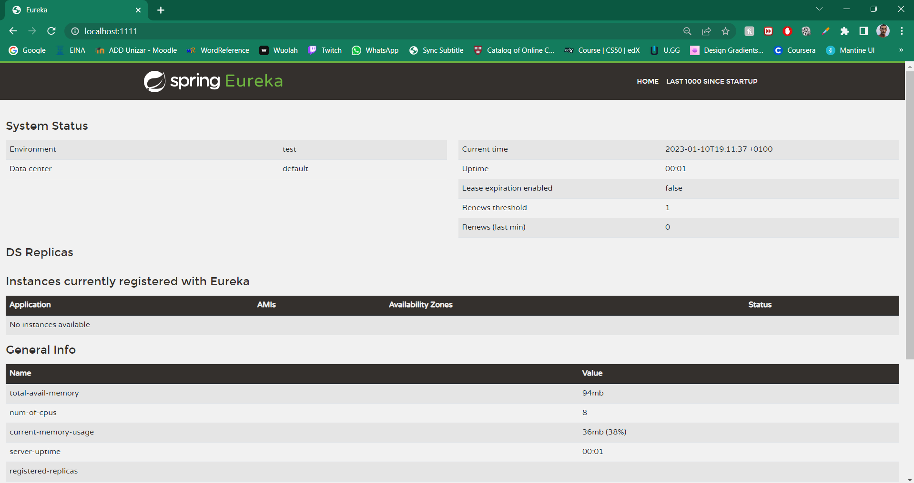

### Account service

The account service uses Spring Data to implement de repository and sprint 
Rest to provide a RESTful interface to account information.

It registers itself with the `discovery-server` at start-up. In this example the name it's `accounts-service`.

Booting the Account service
```bash
./gradlew accounts:bootRun
```

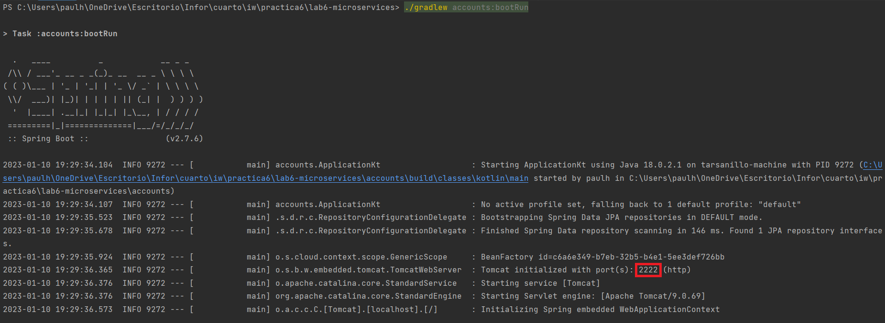

It's exposed at `http:localhost:2222`

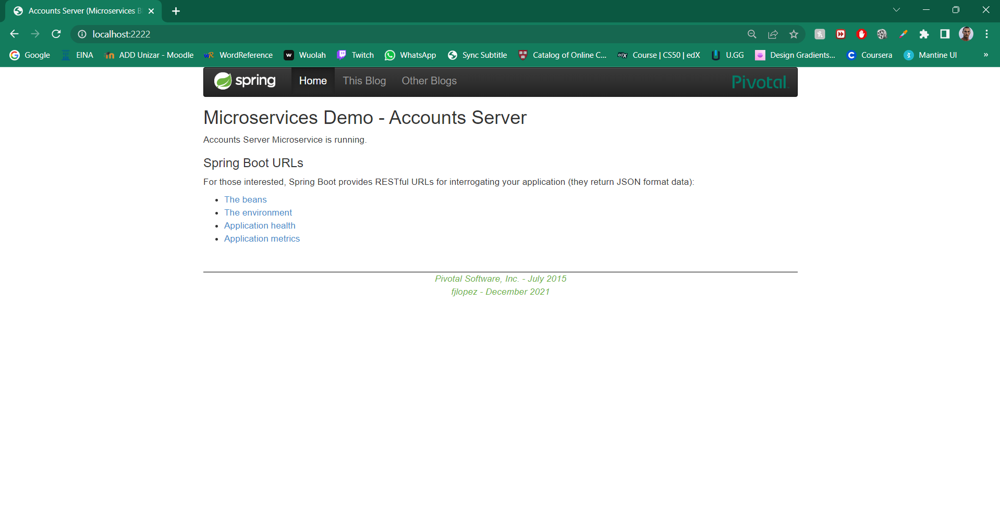

### Web service

The web controller is a typical Spring MVC view-based controller returning HTML.

It also registers itself with the `discovery-server`. In this example the name it's `web-service`.

Booting the Web service
```bash
./gradlew web:bootRun
```

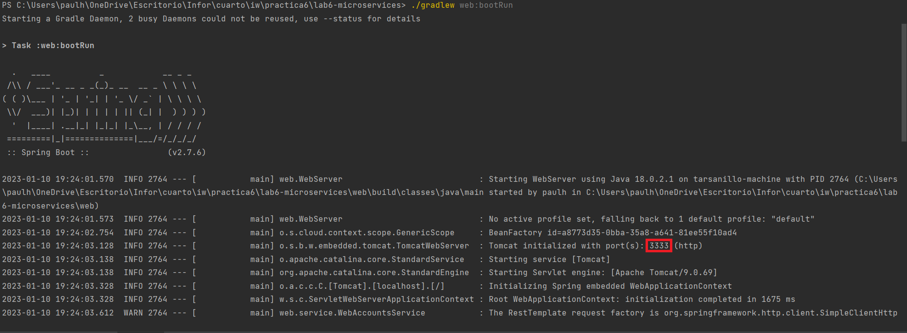

It's exposed at `http:localhost:3333`

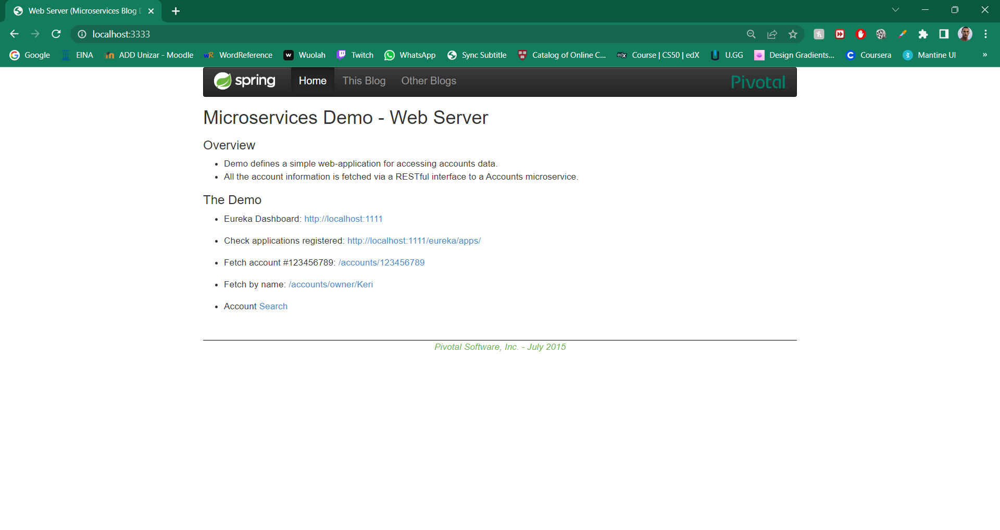

### Extra account service

We're adding another accounts services to the service changing the port in the `application.yaml` file where it's configurated.
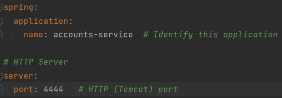

Then we boot again the extra account services
```bash
./gradlew accounts:bootRun
```
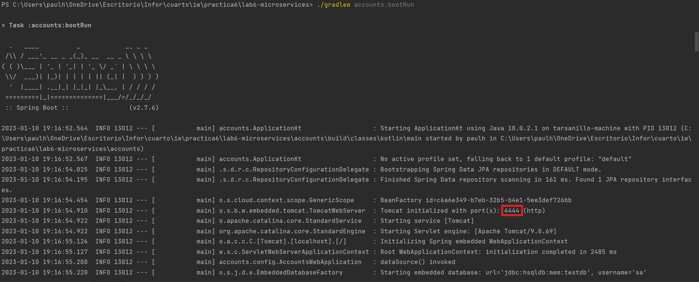

It's exposed at `http:localhost:4444`

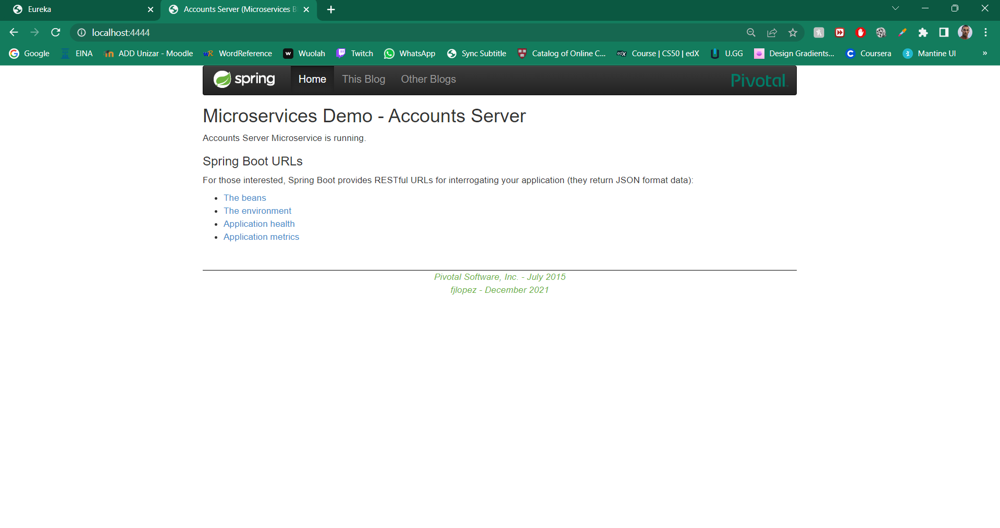

### Using the application
We can see that in the Eureka registration server the new service it's registered with the correct port.
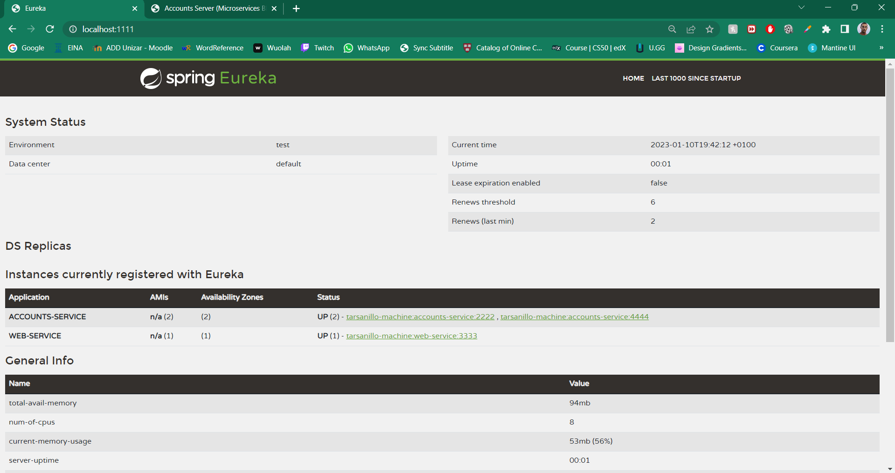

### Killing server 2222

What happens when we kill the accounts server `2222` and do requests to web server `3333`?

When we kill the accounts server `2222`:

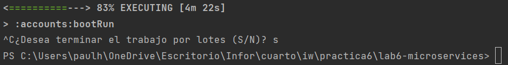

It won't be exposed at `http:localhost:2222` anymore.

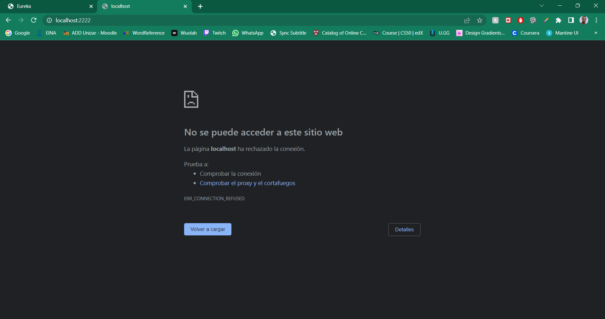

On the other side, the first time that you do a request to web it will display:

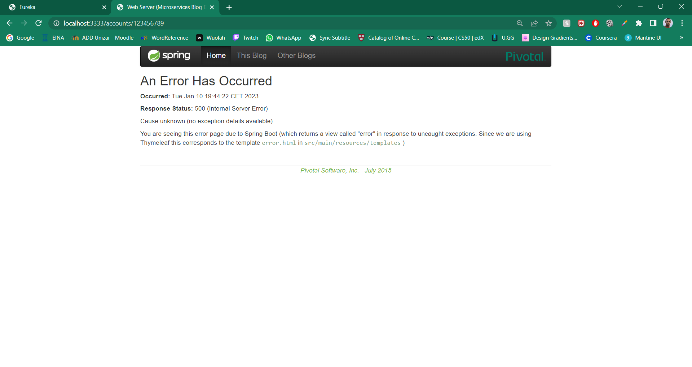

But the next time, the request will still be sent to the client.

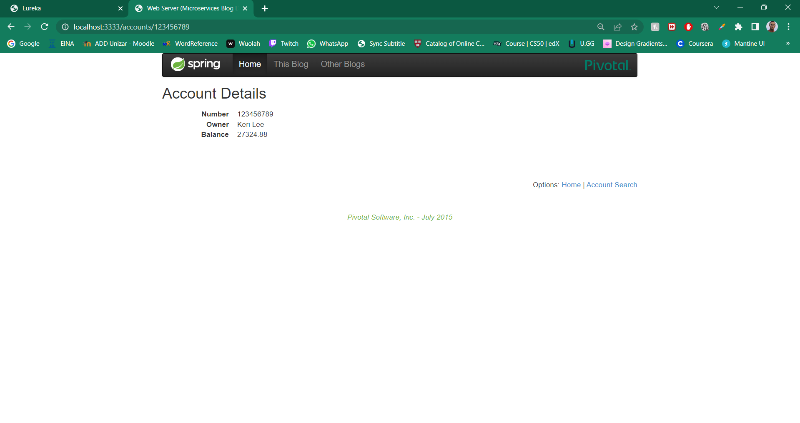

### Why is it working?
It's working because Eureka searches if there is one application available to do the task, it won't search for the exact server.
If it fails, it redirects the next requests to the service that it knows is registered and available.